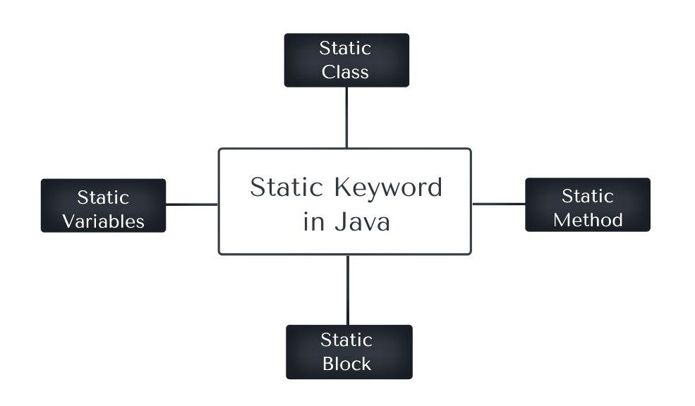
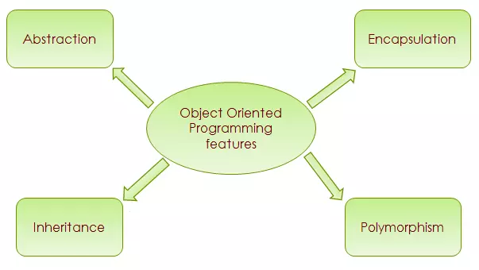
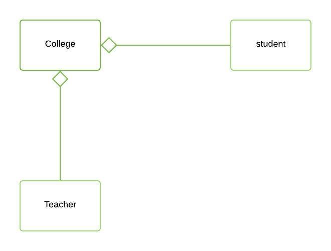

# **Java Core** 
## Table of content
**Syntax**

1. [Variable](#1-variable)

2. [User input](#2-user-input)

3. [Arithmetic](#3-arithmetic)

4. [If Statements](#4-if-statements)

5. [Random Number](#5-random-number)

6. [Math class](#6-math-class)

7. [Printf](#7-printf)

8. [Nested If Statements](#8-nested-if-statements)

9. [Ternary Operator](#9-ternary-operator)

10. [String methods](#10-string-methods)

11. [Substrings](#11-substrings)

12. [Enhanced Switches](#12-enhanced-switches)

13. [Logical Operators](#13-logical-operators)

14. [While loops](#14-While-loops)

15. [For loops](#15-for-loops)

16. [break & continue](#16-break-&-continue)

17. [Nested Loops](#17-nested-loops)

18. [Methods( Function)](#18-methods-function)

19. [Variable scope](#19-variable-scope)

**Array**

20. [Array](#20-array)

21. [2D array](#21-2d-array)

**Object-Oriented Programming**

22. [OOP( Object-Oriented Programming)](#22-oop-object-oriented-programming)

23. [Tính chất của OOP](#23-tính-chất-của-oop)

* [Inheritance( Kế thừa)]()
* [Abstract( Trừu tượng)]()
* [Polymorphism ( Đa hình)]()
* [Encapsulation ( Đóng gói)]()

24. [Association( Liên kết)](#24-association-liên-kết)
25. [Aggregation( Kết tập/ Tổng hợp)](#25-aggregation-kết-tập-tổng-hợp)
26. [Composition( Hợp thành)](#26-composition-hợp-thành)
27. [Wrapper classes](#)
28. [ArrayList](#)
29. [](#)
30. [Exception Handling](#)
31. [Write files](#)
32. [Read files](#)
33. [Date & Time](#)
34. [Anonymous Classes](#)
35. [TimeTask](#)
36. [Countdown Timer](#)
37. [Generics](#)
38. [Hashmaps](#)
39. [Enums](#)
40. [Threading](#)
41. [MultiThreading](#)
42. [](#)


## **About Java**
Phải download **Java Development Kit (JDK)** và phải có **Intergrated Development Enviroment (IDE)** 


## **1.Variable:**
Biến được khai báo có thể có giá trị hoặc không có giá trị truyền vào:

`int username; //declare without value`

`String username = "dev Thoai"; //declare with value be assigned`

## **2. User input:**
Java thực hiện lấy thông tin đầu vào của người dùng thông qua thư viện Scanner và nó thực hiện lấy giá trị thông qua các method như: `.nextLine(), .nextInt(), .nextDouble() ...`

example: 

<!-- Code minh họa--->
```
 import java.ulti.Scanner;//khai báo thư viện Scanner 

 Scanner scanner = new Scanner(System.in);//khởi tạo scanner

 String name;

 System.out.println("Vui lòng nhập tên của bạn");
 name = scanner.nextLine();
 System.out.println("Tên của bạn là: " + name);

 scanner.close(); 
```
## **3. Arithmetic:**
Phép toán thông thường, tham khảo thêm: [Java Arithmetic Operators](https://www.geeksforgeeks.org/java/java-arithmetic-operators-with-examples/).

## **4. If Statements:**
Thực hiện khối câu lệnh bên trong if nếu điều kiện if thỏa mãn
``` 
    if(condition){
        condition true
        //execute statements
    }   
    else{
        condition false
        //execute statements
    }
```

## **5. Random Number:**
Thực hiện khởi tạo một số ngẫu nhiêu trong khoảng a- b;

example: 

```
import java.ulti.Random;

Random random = new Random();
int number ;
number = random.nextInt(); //thực hiện lấy số ngẫu nhiên từ -2 billion cho tới 2 billion
number1 = random.nextInt(a, b);// random trong khoảng từ a- b
```

## **6. Math class:**
Một vài hàm có sẵn để tính toán như căn bậc 2, trị tuyệt đối, số Pi ... 

vd: `pow(), sqrt(), Pi, E, abs()`

Bạn có thể tham khảo thêm một số hàm toán học có sẵn tại [GeeksforGeeks](https://www.geeksforgeeks.org/java/java-math-class/).

## **7. Printf:**
>    **printf()**  là phương thức được sử dụng cho format của ouput

Xem thêm tại đây: [format output](https://www.geeksforgeeks.org/java/formatted-output-in-java/)

## **8. Nested If Statements:**
```
if(condition){
    if(condition){
//statement
    }
    else{
//statement

    }
}
    else{
//statement

    }
```

## **9. Ternary Operator:**
```
    //ternary operator ? = return 1 of 2 values if a condition is true.
    // variable = (condition)?ifTrue: ifFalse;
    int become = 30000;
    double taxRate = (income >= 40000) ? 0.25: 0.15;
    System.out.println( taxRate);
```

## **10. String methods:**
Xem thêm : [Java String methods](https://www.geeksforgeeks.org/java/java-string-methods/).

## **11. Substrings:** 
Xem thêm : [Java SubString methods](https://www.geeksforgeeks.org/java/substring-in-java/).

## **12. Enhanced Switches:**
Syntax:
```
switch(Var){
    case valueOfVar -> {statements};
    case valueOfVar -> {statements};
    case valueOfVar -> {statements};
    case valueOfVar -> {statements};
    default -> {statements}
}
```
## **13. Logical Operators:**

## **14. While loops:**
while loops will repeat some code forever while some condition remain true.

`while (condition){statements};`
## **15. For loops:**
For loops execute some code a **CERTAIN amount of times**.

## **16. break & continue:**
**break** = break out of a loop( STOP)

**continue** = skip current interaction of a loop( SKIP)

## **17. Nested Loops:**
A loop inside another loop used often with matrices or DS&A.

## **18. Methods( Function):**
Method is **a block of reusable code** that is executed when called ().

## **19. Variable scope:**

## **20. Array:**
- This contain many variables that have same data_type.
Syntax: 

`data_type[] var_name= {value1, value2,..., valueN}`

- If you just declare and dont assgign value in, you have to allocate memory for array:

`data_type[] var_name = new data_type[numOfValue];`

- If you wanna find position of each value you can try lieanr search, like count by length and when each value equal which value you find -> return it. If array have same value( over two same value) you have to return sub array( which save same value you want to find).
- And in here have new content `varargs` stand for `variable arguments` . Like `array`, work with `varargs` like with array but with `array` you must assign value before pass into function, `varargs` you dont need do that, this will be assigned when process executed. 
## **21. 2D array:**

## **22. OOP( Object-Oriented Programming):**
* `Object` is a entity that holds data( attributes) and can perform     actions (methods). Its a reference data type.
    
* We have some concepts in Object:

    * **Constructor**: this is a special method to initialize objects. You can pass arguments to a constructor and set up initial values.

    ```
    public class Student{
        String name;
        int age;
        String address;

        Student(){
            //this is default constructor
        }

        //this is Parameterized constructor
        Student(String name, int age, String address){
            this.name = name;
            this.age = age;
            this.address = address;
        }
    }
    ```
    **Note:** Constructor will executed when Object initialized:
    
        ```
        Student std = new Student()//default constructor will execute
        ```

    * **Overloaded Constructors:** Same like overloaded methods.

    * **Array of Objects**:

    * **static**:
Chủ yếu được dùng để quản lý bộ nhớ, chúng ta có thể áp dụng static với các biến, phương thức và các khối lồng nhau. `static` có vai trò quan trọng trong Java, đặc biệt trong quản lý tài nguyên và hiệu suất chương trình. Vậy `static` trong Java là gì?
    
    `static` trong Java được sử dụng để xác định rằng một thành viên của lớp ( biến hoặc phương thức) thuộc về chính lớp đó, thay vì đối tượng ( instance) của lớp. Điều này có nghĩa là thành viên `static` có thể truy cập được mà không cần phải khởi tạo đối tượng.
    
    

Như vậy, đối với`static` chúng ta có những khái niệm liên quan như:
* **Static Variable:** 
    * Khi một biến được khai báo với từ khóa là `static` thì biến đó được gọi là biến static( biến tĩnh).
    * Việc cấp phát bộ nhớ cho biến `static` chỉ được thực hiện 1 lần khi class được nạp vào bộ nhớ. Giá trị mặc định khi biến `static` và `non-static` được khai báo là như nhau.
    * Biến `static` có thể được sử dụng làm thuộc tính chung, để dùng chung dữ liệu cho tất cả `objects` hoặc (instances) của lớp đó và giúp cho chương trình tiết kiệm bộ nhớ hơn.
    * Nếu một biến có cả `static` và `final` thì biến đó được gọi là ` hằng số` và được quy ước là viết hoa toàn bộ tên biến và được nối với nhau bằng kí tự ` _ ` nếu có nhiều từ nối lại.

    ```
    public static final PI = 3.14; 
    public static final SECRET_KEY = "devThoai110503"; 
    ```  

    * Trong `interface` mặc định một biến sẽ được khai báo là `public static final`.

Vd:
`public static String name = "dev Thoai";`
* **Static Method:** Tương tự như `static variable`, một method được khai báo với key là `static` thì method đó là method tĩnh( static).

Vd:
```
public static void changeWebsite(String website){
    MyWebsite.WEBSITE = website;
}
```
* **Static Block:** Được sử dụng để khởi tạo thành viên static.
* **Static Class:** Một class có thể được đặt là `static` khi nó là một `nested class`. Một `nested static class` có thể được truy cập mà không cần một `object` của một `outer class` ( Lớp bên ngoài).

## **23. Tính chất của OOP:**
Tài liệu tham khảo thêm về Java OOP: [Tính chất OOP](https://viblo.asia/p/tim-hieu-tinh-da-hinh-trong-java-EoW4omXALml)

Object-Oriented Programming( OOP) là một khái niệm quang trọng trong xuyên suốt lập trình, hầu như trong xuyên suốt bất kì Project nào đó thì đều có sự góp mặt của OOP. OOP có 4 tính chất cơ bản.
    
### **a. Kế thừa( Inheritance)**: Là một lớp kế thừa toàn bộ các attributes và methods của lớp cha thông quan từ khóa `exxtend`
    * **super:**
    * **method overriding:** Khi lớp con( subclass) cung cấp hành vi của method của chính nó để ghi đè lên method đã được định nghĩa ở lớp cha để thay đổi hành vi của method. Cho phép code được tái sử dụng với một hành vi chi tiết được đưa vào.
### **b. Trừu tượng( Abstraction)**: 
    * Used to define abstract classes and methods. Abstraction is a process of **hidding implementation details** and **showing only the essential features**. 
    * Abstract classes  CANT be instantiated directly.
    * Can contain `'abstract'` methods( which must be implemented).
    * Can contain `'concrete'` methods (which are inherited).

    ví dụ:
```
public abstract class Shape{
    abstract double area(); //ABSTRACT

    void display(){//CONCRETE
        System.out.println("This is a shape.");
    }
}
```

**Sự khác nhau giữa Interface và Abstraction:**

* **Interface:** 
    * Interface is a `blueprint` for a class that specifies a set of abstract methods that implementing classes MUST define. Supports multiple inheritance- like behavior.
    * Khác với abstract, interface sử dụng từ khóa implement cho subclass

### **c. Đóng gói( Encapsulation)**:
    * `Encapsulation` là quá trình bảo vệ các thông tin quan trọng (như thông tin người dùng, thông tin bảo mật khác...) thông qua phạm vi truy cập như private protected và chỉ public các thông tin, method cần thiết để thực hiện chương trình.
    * Như ở ví dụ dưới đây,các thuộc tính như `accountNumber` và `balance` được bảo vệ thông qua một biến `private` và chỉ có thể thao tác thông qua các hàm như `deposit()`, `withdraw()` và các `getter`.

    ```
    public class BankAccount {
    private String accountNumber; // Số tài khoản
    private double balance; // Số dư

    // Các phương thức để thực hiện giao dịch và cập nhật số dư
    public void deposit(double amount) {
        // Thêm số tiền vào số dư
        balance += amount;
        // Các bước khác để cập nhật giao dịch, ví dụ như lưu vào lịch sử giao dịch
    }

    public void withdraw(double amount) {
        // Kiểm tra điều kiện trước khi rút tiền
        if (amount <= balance) {
            // Trừ số tiền khỏi số dư
            balance -= amount;
            // Các bước khác để cập nhật giao dịch và lịch sử rút tiền
        } else {
            System.out.println("Số dư không đủ để thực hiện giao dịch.");
        }
    }

    // Các phương thức getter để truy cập thông tin tài khoản một cách an toàn
    public String getAccountNumber() {
        return accountNumber;
    }

    public double getBalance() {
        return balance;
    }
    }
    ```

### **d. Đa hình( Polymorphism)**:
    * `PolyMorphism` được định nghĩa là đa hình( Poly = Many, Morph = Shape).
    * Một đối tượng có thể được định nghĩa lại bằng một đối tượng khác, ở đây đối được cha hay còn được gọi là đối tượng cơ sở được các đối tượng con identify lại.
    * Objects can be treated as objetcs of a common superclass( các đối tượng có thể được coi như là đối tượng của chung một lớp cha).
    * PolyMorphism có 2 loại đa hình, là đa hình tại quá trình biên dịch( Compile-runtime PolyMorphism) và quá trình runtime(Runtime Polymorphism).
        * `Compile- Runtime PolyMorphism` thường là quá trình Method Overloading và Operator Overloading như trong Java không sử dụng Operator Overloading.
        ```
        class Calculator {
            int add(int a, int b) {
                return a + b;
            }

            double add(double a, double b) {
                return a + b;
            }
        }
        ```

        * `Runtime Polymorphism` được thực hiện thông qua kế thừa( `Inheritance`) hoặc `Method Override`.
        ```
         class Animal {
            void makeSound() {
        System.out.println("Animal makes a sound");
            }
            }

        class Dog extends Animal {
            void makeSound() {
                System.out.println("Dog barks");
            }
        }

        class Cat extends Animal {
            void makeSound() {
                System.out.println("Cat meows");
            }
        }
`
    ```

## **24. Association( Liên kết):**
* `Association` là một khái niệm cốt lõi( cardinal concept) trong OOP, nó mô tả mối quan hệ giữa các lớp( classes) độc lập nhau
* `Association` có thể được xem như là một mối quan hệ "uses-a" nơi mà một object sủ dụng hoặc nhiều tương tác theo nhiều cách với một object khác.
* `Association` có thể là đơn hướng( unidirectional) hoặc song hướng( bidirectional) và có thể tồn tại dưới nhiều dạng khác như `one-to-one`, `one-to-many`, `many-to-one` và `many-to-many`.
* Có 2 loại liên kết( Association) là `unidirectional` và `bidirectional`.
    * `Uni-Directioonal`: có nghĩa là chỉ có một mình nó có thể nhận ra và liên kết với lớp khác chứ ngược lại thì không đúng. Ví dụ như đối với class `Student()` và `LibraryCard()` với mối quan hệ là "học sinh có thẻ thư viện" chứ không có mối quan hệ ngược lại là "Thẻ thư viện có học sinh". 
    * `Bi-Directional`: có nghĩa là 2 lớp đều nhận biết nhau và đều tương tác với lớp khác. Ví dụ như mối quan hệ giữa `Teacher()` và `Classroom()`.
## **25. Aggregation( Kết tập/ Tổng hợp):**
* Được mô tả là một mối quan hệ `has-a` giữa các objects.
* Một object chứa object khác như một phần cấu trúc của nó nhưng object được chứa **có thể tồn tại một cách độc lập.**
* Ví dụ là một class phòng ban( `Department ()`) sơ hữu thuộc tính class `Teacher()` là danh sách các giáo viên nhưng 2 thực thể này vẫn tồn tại độc lập nhau mà không cần phải phụ thuộc. 
* Nó là một dạng đặc biệt của liên kết( Association):
    * Nó đại diện cho mối quan hệ `has-a`.
    * Là liên kết đơn hướng( Uni-Directional Association).
    * Trong Aggregation, cả hai thực thể có thể tồn tại riêng lẻ, nó có nghĩa là khi một entity kết thúc( hủy bỏ) thì nó không ảnh hưởng tới entity khác.
    
## **26. Composition( Hợp thành):**
* `Composition` được đề cập là một mối quan hệ `part-of` giữa các objects. Ví dụ, một Engine là `part-of` Car.
* Cho phép các object phức hợp( Complex Objects) được xây dựng từ các object nhỏ hơn.

## **27. Wrapper classes:**
* `Wrapper classes` cho phép các dữ liệu nguyên thủy( primitive values) như int, char, boolean được sử dụng như một `object`.
* Lưu ý không nên 'wrap' các primitive value nếu bạn không cần một `object`.
* Việc 'wrap' các primitive value cho phép chúng được sử dụng các `Collections Framework` và các `static Utility Methods` để được sử dụng trong `ArrayList`( Vì Arraylist chỉ chấp nhận các Object). Và trong `Wrapper Classes` có 2 khái niệm cơ bản là `Unboxing` và `AutoBoxing`.
    * `AutoBoxing`: là quá trình tự động chuyển từ `primitive value` thành các lớp `Wrapper` tương ứng được Java thực hiện ngầm nhằm tiết kiệm thời gian.
    ```
    Integer number = 10; // Autoboxing: int được tự động chuyển thành Integer
    ArrayList<Integer> list = new ArrayList<>();
    list.add(5); // Autoboxing: 5 (int) được chuyển thành Integer

    ```
    * `UnBoxing`: Ngược lại với `AutoBoxing` thì `UnBoxing` là quá trình tự động chuyển đổi đối tượng lớp `Wrapper` về `primitive value` tương ứng.

    ```
    Integer number = new Integer(20);
    int value = number; // Unboxing: Integer được chuyển thành int
    ```

    * Ví dụ về sự chuyển đổi giữa `primitive value` thành `Wrapper classes` và ngược lại:
    ```
    import java.util.ArrayList;

    public class WrapperExample {
    public static void main(String[] args) {
        // Autoboxing
        Integer num = 100; // int -> Integer
        ArrayList<Integer> numbers = new ArrayList<>();
        numbers.add(200); // int -> Integer

        // Unboxing
        int value = num; // Integer -> int
        int sum = numbers.get(0) + 50; // Integer -> int, sau đó thực hiện phép cộng

        System.out.println("Giá trị của num: " + value);
        System.out.println("Tổng: " + sum);
    }
    }

    ```
## **28. ArrayList:**
* `ArrayList` là một `resizeable array` được dùng để lưu trữ các dữ liệu `objects`( autoboxing). ArrayList khắc phục đi hạn chế của `Array` là `Array` luôn luôn phải cấp phát một kích thước cố định( fixed size) khi khởi tạo còn `ArrayList` thì không.
```
ArayList<Integer> list = new ArayList<Integer>(); // ở đây chỉ có thể dùng các Wrapper class chứ không được dùng primitive value
list.add(1);
list.add(2);
list.add(3);

System.out.println(list);
```
>Output:    [1, 2, 3]

* Ngoài .add() ra còn có các hàm khác như remove()... tham khảo tại : [ArrayList Methods GFG](https://www.geeksforgeeks.org/java/arraylist-in-java/).

## **30. Exception Handling:**
* `Exception` là một sự kiện làm ngắt quãng( Interrupts) một flow( luồng) của một chương trình( Diving by zero, file not found, mismatch, input type...). Thông thường là lỗi `runtime`.
* Bao bọc mọi mối nguy hiểm tiềm ẩn trong code của bạn bằng khối `try{} block` `try{} catch(){} finally{}`. Giúp chương trình tránh đi những lỗi runtime không đáng có và vẫn tiếp tục thực hiện chương trình sau khi throw ra Exception.

```
try {
    // Code that might throw an exception
    int result = 10 / 0; // This will throw an ArithmeticException
} catch (ArithmeticException e) {
    // Handle the ArithmeticException
    System.out.println("Error: Cannot divide by zero.");
}
```

## **31. Write files:**
* Việc thực hiện Write files trong Java có 4 lựa chọn phổ biến:
    * `FileWriter` = Thực hiện tốt cho input files có kích thức nhỏ hoặc vừa.
    * `BufferedWriter` = Thực hiện tốt cho một lượng lớn văn bản đầu vào.
    * `PrintWriter` = Thực hiện tốt cho cấu trúc dữ liệu như `reports` or `logs`.
    * `FileOutputStream` = Thực hiện tốt cho file nhị phân( binary files) như Imges,audio files.

## **32. Read files:**

## **33. Date & Time:**

## **34. Anonymous Classes:**

## **35. TimeTask:**

## **36. Countdown Timer:**

## **37. Generics:**
* `Generics` là nơi bạn có thể viết `class`, `interface`, hoặc `methods` mà nó có thể tương thích( compatible) với mọi kiểu dữ liệu khác nhau.
* `<T>` kiểu tham số (type paramater) nó có thể được thay thế với một kiểu dữ liệu thực. Trong đó `T` có thể có 1 hoặc nhiều tham số đầu vào là kiểu dữ liệu khác nhau. Ví dụ :
```
ArrayList<T> stringList = new ArrayList<T>();//tạo một arraylist với kiểu dữ liệu là T
```
* Bởi vì `generics` được khai báo kiểu dữ liệu tổng quát cho nên nó có thể kiểm soát tốt được các lỗi `runtime` có thể xảy ra với chương trình.
```
// Không dùng Generics
List list = new ArrayList();
list.add(10);
list.add("Java");
for (Object obj : list) {
    Integer value = (Integer) obj; // Gây lỗi runtime nếu obj là String
    System.out.println(value);
}

// Có Generics
List<Integer> list = new ArrayList<>();
list.add(10);
// list.add("Java"); // Compile-time: Lỗi
for (Integer value : list) {
    System.out.println(value); // Không bao giờ lỗi runtime
}

```
* `generic` trong Java có thể có `generic class` và `generic method`
    * **`generic class`** cho phép bạn có để định nghĩa kiểu dữ liệu tổng quát( generic ) tại thời điểm khai báo. Với `generic class` bạn có thể linh hoạt trong việc viết mã và tái sử dụng `class` một cách an toàn.
    ```
    class ClassName<T> {
    private T value;

    public void setValue(T value) {
        this.value = value;
    }

    public T getValue() {
        return value;
    }
    }
    ```
    * Trong đó thì `T` được đại diện cho `data type` (ví dụ String, Integer...). Bạn có thể sử dụng bất kì kí tự nào nhưng để dễ dàng kiểm soát thì nên sử dụng các kí tự liên quan đến mục đích( T: type, E: element, K: key, V: value). Dưới đây là một ví dụ cụ thể trong việc sử dụng `generic class`:
    ```
    // Định nghĩa Generic Class
    class Box<T> {
        private T item;

        public void setItem(T item) {
            this.item = item;
        }

        public T getItem() {
            return item;
        }
    }

    // Sử dụng Generic Class
    public class Main {
        public static void main(String[] args) {
            Box<String> stringBox = new Box<>();
            stringBox.setItem("Hello Generics");
            System.out.println("String Box: " + stringBox.getItem());

            Box<Integer> integerBox = new Box<>();
            integerBox.setItem(123);
            System.out.println("Integer Box: " + integerBox.getItem());
        }
    }

    ```
    * Như đã nói ở trên thì `generic class` có hỗ trợ nhiều tham số cùng một lúc( multiple type paramaters):
    ```
    class Pair<K, V> {
    private K key;
    private V value;

    public Pair(K key, V value) {
        this.key = key;
        this.value = value;
    }

    public K getKey() {
        return key;
    }

    public V getValue() {
        return value;
    }
    }        

    public class Main {
        public static void main(String[] args) {
            Pair<String, Integer> pair = new Pair<>("Age", 30);
            System.out.println("Key: " + pair.getKey());
            System.out.println("Value: " + pair.getValue());
        }
    }
    ```
    * Bạn có thể giới hạn tham số bằng cách `extends` `data_type`. Dưới đây là ví dụ vể giới hạn tham số và chi tiết là giới hạn kiểu trong kiểu `Number`.
    ```
    class NumberBox<T extends Number> {
    private T number;

    public void setNumber(T number) {
        this.number = number;
    }

    public T getNumber() {
        return number;
    }
    }

    public class Main {
        public static void main(String[] args) {
            NumberBox<Integer> intBox = new NumberBox<>();
            intBox.setNumber(100);
            System.out.println("Integer: " + intBox.getNumber());

            NumberBox<Double> doubleBox = new NumberBox<>();
            doubleBox.setNumber(10.5);
            System.out.println("Double: " + doubleBox.getNumber());

            // NumberBox<String> stringBox = new NumberBox<>(); // Lỗi compile-time
        }
    }

    ```
    > **\<T extends Number\>** giới hạn giá trị của T chỉ nằm trong phạm vi Number( Integer, Double,...)

    * **`generic method`:** là phương thức cho phép người dùng sử dụng kiểu dữ liệu tổng quát( generic) thay vì kiểu dữ liệu cố định. `generic method`  sẽ được định nghĩa khi phương thức được gọi.
    ```
    public <T> ReturnType methodName(T parameter) {
    // Thân phương thức
    }
    ```

    > **\<T\>**: khai báo một tham số với kiểu dữ liệu tổng quát.
    > **T paramater**: Sử dụng kiểu dữ liệu `generic` làm tham số 
    > **ReturnType**: Phương thức có thể trả về kiểu `T` hoặc kiểu khác.

    ```
    public class GenericMethodExample {

    // Generic method
    public static <T> void printArray(T[] array) {
        for (T item : array) {
            System.out.println(item);
        }
    }

    public static void main(String[] args) {
        String[] stringArray = { "Apple", "Banana", "Cherry" };
        Integer[] intArray = { 1, 2, 3 };

        // Gọi phương thức generic
        printArray(stringArray);
        printArray(intArray);
    }
    }

    ```
    > Output: 
    ```
    Apple
    Banana
    Cherry
    1
    2
    3
    ```
    

## **38. Hashmaps:**
Là một lớp kế thừa từ `Interface Map` nằm trong `**Collections Framework**`

(Đây là MrThoi thay đổi)
(Đây là Thoai 2 thay đổi để rebase)
## **39. Enums:**
(Đây là Thoi 2 đổi)
(Đây là MrThoi thay đổi để rebase)
## **40. Threading:**

## **41. MultiThreading:**

## **42. Alarm Clock:**